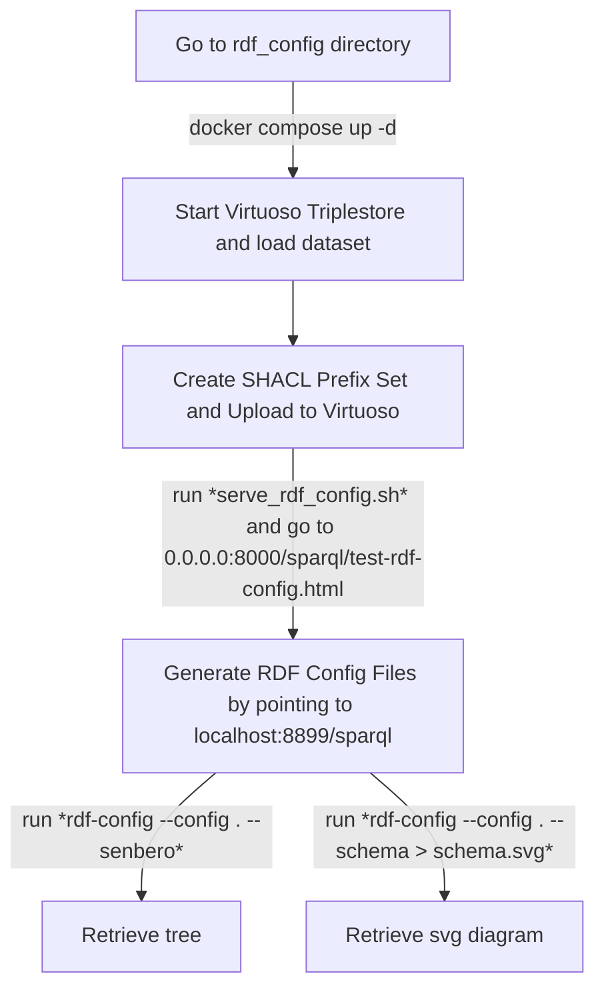

# elixir_biohackathon_2024

# Workflow to generate RDF-config files from any RDF graph

## Requirements

- Docker
- Java
- Python3
- VoID generator release (https://github.com/JervenBolleman/void-generator/releases)
- RDF config (https://github.com/dbcls/rdf-config)

Check out the [RDF Config Documentation](rdf_config_documentation) directory for more details.
To get the VoID generator and RDF-Config, you can run the bash script using `` command. 

## Steps



1. **Start Virtuoso Triplestore (`docker compose up -d`):**  
   Ensure you're in the correct directory and execute this command to start Virtuoso.

2. **Access Virtuoso Conductor (`http://localhost:8899/`):**  
   Login at this address to manage the Virtuoso instance and go to the `Conductor` tab. Default credentials are `dba` with `CONDUCTOR_PASSWORD`. 

3. **Generate VoID file**
Generate the VoID file using the following commands:
```bash
wget -P "void-generator" "https://github.com/JervenBolleman/void-generator/releases/download/v0.5/void-generator-0.5-uber.jar"

java -jar void-generator/void-generator-0.5-uber.jar \
  --from-test-file=GRAPH_PATH.ttl \
  -i https://TTL_PATH.example.org/.well-known/void \
  -r https://TTL_PATH.example.org/sparql \
  -s VOID_FILE_NAME-void.ttl
```

3. **Upload VoID RDF Data:**  
   Use this interface to upload RDF graphs and manage namespaces. To do so, go to the `Linked Data` tab and click the `Quad Store Upload`. Upload the turtle file and add a custom IRI (eg. http://localhost:8899/sparql/).

4. **Allow CORS:**  
   To allow Cross-Origin Resource Sharing (CORS), follow [these instructions](https://vos.openlinksw.com/owiki/wiki/VOS/VirtTipsAndTricksCORsEnableSPARQLURLs). We sumamrize some steps below:
   * Go to `Web Application Server` tab and click on `Virtual Domains & Directories`
   * Click on the folder icon for the default web site
   * In the expanded Interface, search for `/sparql`
   * Edit the `Cross-Origin Resource Sharing` input to `*` and save the edit.

5. **Create the SHACL Prefixes file:**  
   Create a preliminary `.shacl` file that lists prefixes for all namespaces in the VoID file, as the `rdf-config` generator depends on these prefixes to label nodes. This file serves as a very basic verison of SHACL file. 
   
   The graph for SHACL prefixes should look like the example below:
   
   If you RDF graph is using the following prefixies:
   ```ttl
   @prefix dcterms: <http://purl.org/dc/terms/> .
   @prefix clinvar: <http://purl.obolibrary.org/obo/pr#> .
   @prefix sparql_service: <http://www.w3.org/ns/sparql-service-description#> .
   ```
   
   The corresponding SHACL file would look as follows:
    ```ttl
    @prefix sh: <http://www.w3.org/ns/shacl#> .
    @prefix xsd: <http://www.w3.org/2001/XMLSchema#> .
    
    [] sh:declare [
      sh:prefix "sparql_service" ;
      sh:namespace "http://www.w3.org/ns/sparql-service-description#"^^xsd:anyURI
    ] .

    [] sh:declare [
        sh:prefix "obo" ;
        sh:namespace "<http://purl.obolibrary.org/obo"^^xsd:anyURI
    ] .
    
    [] sh:declare [
      sh:prefix "clinvar" ;
      sh:namespace "http://purl.jp/bio/10/clinvar/"^^xsd:anyURI
    ] .
    
    [] sh:declare [
      sh:prefix "dcterms" ;
      sh:namespace "http://purl.org/dc/terms/"^^xsd:anyURI
    ] .
    ``` 

6. **Upload the SHACL Prefixes file to Virtuoso:** 
    Upload the SHACL file the same way as you did the graph file previously. 

8. **Run RDF-Config server `sh run.sh`:**  
   This script deploys [a local RDF config tool](https://github.com/JervenBolleman/void-generator/blob/main/sparql/test-rdf-config.html) interface accessible at your local port (Eg. `http://0.0.0.0:8000/test-rdf-config.html`), allowing you to generate RDF configuration files based on the Virtuoso SPARQL endpoint.

9. **Configure RDF Generator (SPARQL Endpoint):**  
   In the RDF config tool (`test-rdf-config.html`), set the endpoint to `http://localhost:8899/sparql/` to generate the configuration files correctly.

   Save the two outputs (model.yaml, prefixes.yaml) in the different yaml in the rdf-config directory.

10. **Retrieve Tree Structure:**  
   Follow the following commands line-by-line to get the schema from RDF-Config.

   ```bash
   cd rdf-config
   bundle install
   ```

   ```bash
   rdf-config --config . --senbero
    ```
    to retrieve an ascii art schema, or

   ```bash
   rdf-config --config . --schema > schema.svg
    ```
    for an svg diagram.
