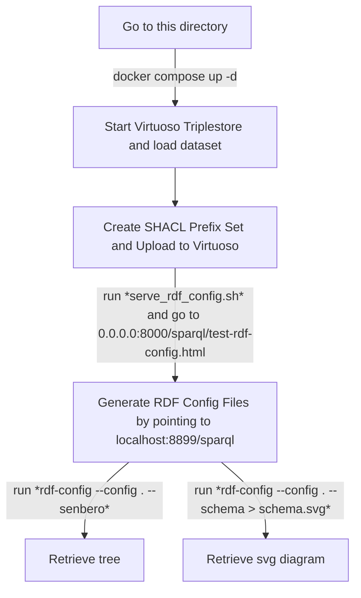

# Workflow to get RDF-config files from any RDF graph

`RDF-config` generates generate SPARQL queries, a schema diagram, and files required for Grasp, TogoStanza and ShEx validator.

## Requirements

- Docker
- Java
- Python3
- VoID generator release (https://github.com/JervenBolleman/void-generator/releases)
- RDF config (https://github.com/dbcls/rdf-config)

## Steps



1. **Start Virtuoso Triplestore (`docker compose up -d`):**  
   Ensure you're in the correct directory and execute this command to start Virtuoso.

2. **Access Virtuoso Conductor (`http://localhost:8899/`):**  
   Login at this address to manage the Virtuoso instance. Default credentials are `dba` with `CONDUCTOR_PASSWORD`. Use this interface to upload RDF graphs and manage namespaces. To allow CORS, follow [these instructions](https://vos.openlinksw.com/owiki/wiki/VOS/VirtTipsAndTricksCORsEnableSPARQLURLs).

3. **Upload RDF Data:**  
   In the Conductor, navigate to `Linked Data` > `Quad Store Upload` and upload your RDF dataset.

4. **Create and Upload SHACL Prefixes:**  
   Create a `.shacl` file that lists prefixes for all namespaces in the dataset, as the `rdf-config` generator depends on these prefixes to label nodes. The graph for SHACL prefixes should look like the example below:

    ```ttl
    @prefix sh: <http://www.w3.org/ns/shacl#> .
    @prefix xsd: <http://www.w3.org/2001/XMLSchema#> .
    
    [] sh:declare [
      sh:prefix "sparql_service" ;
      sh:namespace "http://www.w3.org/ns/sparql-service-description#"^^xsd:anyURI
    ] .
    
    [] sh:declare [
      sh:prefix "clinvar" ;
      sh:namespace "http://purl.jp/bio/10/clinvar/"^^xsd:anyURI
    ] .
    
    [] sh:declare [
      sh:prefix "dcterms" ;
      sh:namespace "http://purl.org/dc/terms/"^^xsd:anyURI
    ] .
    ```


5. **Run `serve_rdf_config.sh`:**  
   This script deploys [a local RDF config tool](https://github.com/JervenBolleman/void-generator/blob/main/sparql/test-rdf-config.html) interface accessible at `http://0.0.0.0:8000/sparql/test-rdf-config.html`, allowing you to generate RDF configuration files based on the Virtuoso SPARQL endpoint.

6. **Configure RDF Generator (SPARQL Endpoint):**  
   In the RDF config tool (`test-rdf-config.html`), set the endpoint to `http://localhost:8899/sparql/` to generate the configuration files correctly.

7. **Retrieve Tree Structure:**  
   Use the command:

   ```bash
   rdf-config --config . --senbero
    ```
    to retrieve an ascii art schema, or

   ```bash
   rdf-config --config . --schema > schema.svg
    ```
    for an svg diagram.
